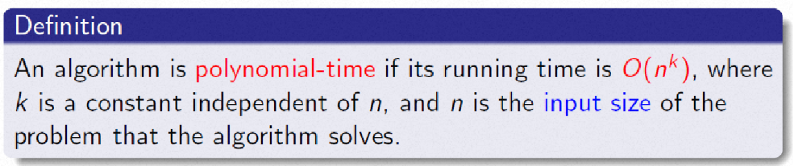
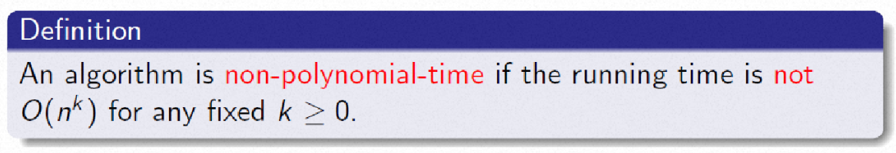
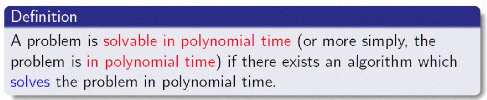
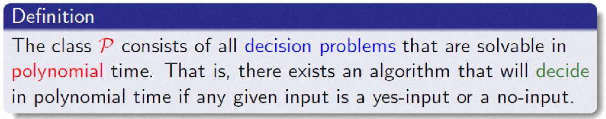
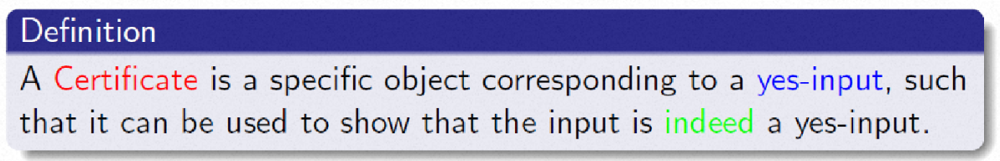
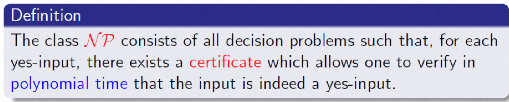
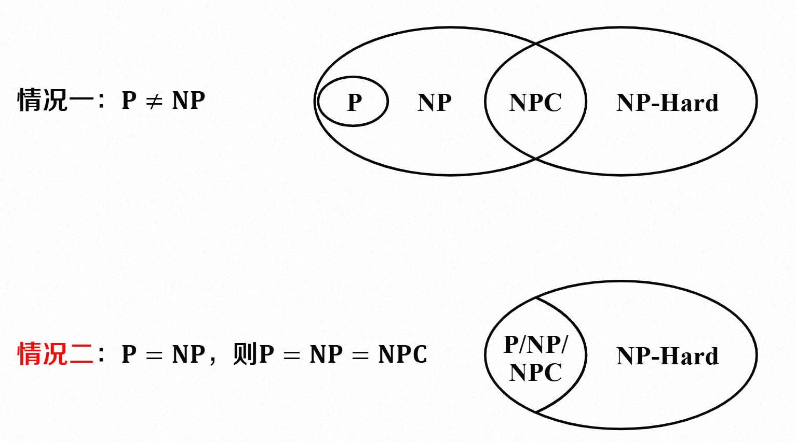

# 复杂性理论：P，NP,NP完全

## NP完全理论
- NP完全问题（NPC），也称为NP完备
    - 是一类问题的集合
    - 被认为是一类难解问题
- 为什么被称为NP完全
    - 如果任意一个NP完全问题存在多项式时间算法，则所有NP都存在多项式时间算法
- NP问题是否存在多项式时间算法仍是开放性问题

## 判定问题
- 判定问题：结果为"是"或"否"
- NP完全理论仅考虑判定问题

## P问题
- 问题实例的编码方案
    - 定义：以计算程序可理解的方式表示问题的实例（抽象问题实例->具体问题实例->计算结果）
- 算法分类
    - 多项式时间算法：给定问题实例 $x\in I$，$|x|=n$，若存在与输入规模 $n$ 无关的常数 $k$、算法 $A$ 在 $O(n^k)$时间内求解该实例，则称 $A$ 为多项式时间算法
    
    - 非多项式时间算法：给定问题实例$x\in I$，$|x|=n$，若不存在与输入规模 $n$ 无关的常数 $k$、算法 $A$ 在 $O(n^k)$时间内求解该实例，则称 $A$ 为非多项式时间算法
    
    - 多项式时间可解问题：（Polynomial-Time Solvable Problems）
    
    - P问题定义：具有多项式时间算法的判定问题
    - P类（class P）问题：所有P问题的集合
    
        - 判断属于：找到多项式时间算法
        - 判断不属于：证明不存在任何多项式时间算法

## NP问题
- 证书(certificate):对应于判定结果为"是"的一组对象

- 验证算法A的定义：
    - 问题实例编码$x$和称为"证书"的二进制编码$y$
    - 如果存在一个证书 $y$满足 $A(x,y)=1$，则算法 $A$验证了输入$x$
- 多项式时间可验证的定义：
    - 在多项式时间内，使用算法$A$验证了输入 $x$
- NP问题：判定问题 $Q$是NP问题，记作($Q\in NP$),当且仅当存在一个多项式时间验证算法 $A$和常数 $c$使得：对于任意判定结果为"是"的实例$x\in Y_1$，存在一个证书 $y$ 且 $|y|=O(|x|^{c})$,满足$A(x,y)=1$
- NP类（NP class）:所有NP问题的集合

## NP完全问题
- 规约：用来描述两个问题之间的关系

    - 如果问题$Q_1$的每个实例都可以"重新表述"为问题$Q_2$问题的一个实例，则称$Q_1$可以归约为$Q_2$，记为 $Q_1\leq Q_2$

    - 如果$Q_1\leq Q_2$，那么$Q_1$的“难度”并不显著高于$Q_2$的“难度”

    - 给定判定问题 $Q_1$ 与 $Q_2$,其实例集分别为 $I_1$ 与 $I_2$,如果存在一个多项式时间可计算的变换 $f$,使得：对于$Q_1$的任意实例 $x$,$f(x)$是$Q_2$的一个实例，且 $x\in Y_{I_1}$当且仅当 $f(x)\in Y_{I_1}$,称为 $Q_1$多项式时间归约至 $Q_2$，记作 $Q_1\leq _p Q_2$,并称 $f$ 为从 $Q_1$到 $Q_2$的多项式时间规约

- 定理:
    - 若 $Q_1\leq _p Q_2$且 $Q_2\in P$ ,则 $Q_1\in P$
- 引理：
    - 若 $Q_1\leq _p Q_2$且 $Q_2\leq _p Q_3$ ,则 $Q_1\leq _p Q_3$

- 定义： 如果判定问题 Q同时满足以下两个条件,则称Q是NP完全的，记为 $Q\in NPC$
    - $Q\in NP$
    - 对于任意判定问题 $Q^{'}\in NP$，均有 $Q^{'}\leq _p Q$

- 所有NP完全问题的集合称为NPC类
- 性质
    - $NPC\in NP$
    - NPC包含了NP中所有的最难的问题
    - 要么所有NPC均多项式时间可解，要么所有NPC均多项式时间不可解
- 定理
    - 如果存在多项式时间可解的NPC问题，则所有NP问题均为多项式时间可解
        - P=NP
    - 截止目前，仍未找到多项式时间可解的NPC问题

- NP完全和NP难  
    - NP完全,记为 $Q\in NPC$
        - ①$Q\in NP$
        - ②对于任意判定问题 $Q^{'}\in NP$，均有 $Q^{'}\leq _p Q$
    - NP难:如果判定问题$Q$满足条件②，$\forall Q^{'}\in NP,Q^{'}\leq _p Q$，则称这类问题是 NP 难的问题

 